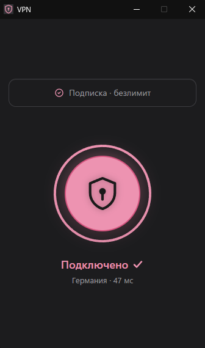

# slvxsVPN

**Lightweight, fast, and simple VPN client for Windows and Android.**

[Русская версия (RU)](README.md) • [Download (.exe / .apk)](https://github.com/slvx666/slvxsVPN/releases/latest)

 

---

## Features

- **Ad-Free YouTube, Twitch & Discord:** Supports split-tunneling and built-in DPI bypass (Zapret on Windows, ByeDPI on Android). Media services open directly via local routing without region-based video ads and at full ISP bandwidth (up to 4K 60 FPS).
- **Dynamic Protocol Support:** Supports automatic protocol selection and on-the-fly switching depending on network conditions (Hysteria2, VLESS Reality, XHTTP).
- **Smart Killswitch on PC:** Protects against real IP leaks during disconnects, while cleanly and instantly restoring default system routing upon manual disconnect.
- **Sleep & Wake Recovery:** Seamlessly handles system sleep mode and Wi-Fi reconnection without requiring manual restarts.
- **Android Integration:** Proper unmetered Wi-Fi validation (no exclamation marks), instant Telegram media downloads, and battery-friendly background operation.
- **One-Click Simplicity:** No bloated configuration menus or confusing toggles — just paste your subscription link and click connect.

---

## Supported Formats & Protocols

- **Connection:** HTTPS subscription URL (automatically manages profiles, server parameters, and routing rules).
- **Tunnel Protocols:** Hysteria2 (QUIC + BBR), VLESS Reality (XTLS-Vision), XHTTP.
- **DPI Bypass Engines:** WinDivert / Zapret (Windows), ByeDPI with fallback DNS resolver (Android).

---

## Installation

Download the latest binaries from the [**Releases Page**](https://github.com/slvx666/slvxsVPN/releases/latest):
- **Windows:** `VPN-Windows-v1.0.37.exe` (standalone portable executable)
- **Android:** `VPN-Android-v1.0.37.apk` (Android 8.0+)
